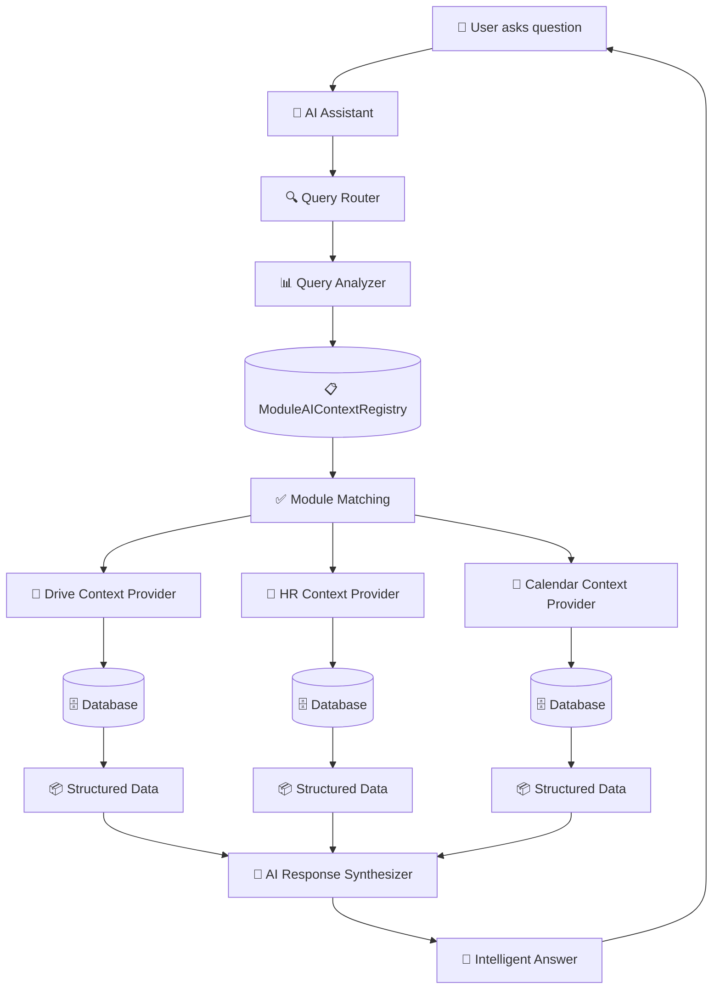

# 🤖 AI Context System Architecture - Complete Guide

## Overview

This document provides a comprehensive visual guide to how the Vssyl AI Context System works, answering key questions about knowledge bases, module memory, and real-time data access.

---

## 🏗️ System Architecture

### High-Level Flow



---

## 📊 Two-Layer Query System

### Layer 1: Fast Keyword Matching (Milliseconds)

```
User Query: "Show my recent files"
           ↓
    Query Analyzer
           ↓
    Keyword Extraction: ["files", "recent", "show"]
           ↓
    ModuleAIContextRegistry Lookup
           ↓
    Matched Modules:
    - Drive (score: 85) ✅
    - Chat (score: 15) ⚠️
    - Calendar (score: 5) ❌
           ↓
    Select Drive module (highest score)
```

**Performance**: < 10ms (indexed database lookup)

### Layer 2: Live Data Fetching (Hundreds of Milliseconds)

```
Selected Module: Drive
           ↓
    Context Provider: "recentFiles"
           ↓
    API Call: GET /api/drive/ai/context/recent
           ↓
    Controller: driveAIContextController.ts
           ↓
    Database Query:
    prisma.file.findMany({
      where: { userId, trashedAt: null },
      orderBy: { updatedAt: 'desc' },
      take: 10
    })
           ↓
    Structured Response:
    {
      recentFiles: [
        { name: "document.pdf", lastModified: "2025-01-15" },
        { name: "image.jpg", lastModified: "2025-01-14" }
      ],
      summary: { totalRecentFiles: 10 }
    }
           ↓
    AI Synthesizes Response:
    "You have 10 recent files. The most recent is document.pdf 
     from January 15th, followed by image.jpg from January 14th."
```

**Performance**: 100-500ms (database query + AI processing)

---

## 🗄️ Knowledge Base Architecture

### Central Database Structure

```
PostgreSQL Database
├── ModuleAIContextRegistry (Module Definitions)
│   ├── moduleId: "drive"
│   ├── keywords: ["file", "upload", "document"]
│   ├── patterns: ["show my files", "upload * to drive"]
│   └── contextProviders: [...]
│
├── UserAIContextCache (Performance Optimization)
│   ├── userId: "user123"
│   ├── cachedContext: { ... }
│   └── expiresAt: "2025-01-15T10:30:00Z"
│
├── AILearningEvent (User-Specific Learning)
│   ├── userId: "user123"
│   ├── sourceModule: "drive"
│   ├── eventType: "correction"
│   └── patternData: { frequency: 5 }
│
├── GlobalLearningEvent (Cross-User Patterns)
│   ├── patternType: "file_naming_preference"
│   ├── frequency: 150
│   └── anonymizedData: { ... }
│
└── Module Data Tables (Actual Business Data)
    ├── File (drive module)
    ├── EmployeePosition (HR module)
    ├── CalendarEvent (calendar module)
    └── ScheduleShift (scheduling module)
```

### Key Points

1. **Single Central Database**: All data lives in PostgreSQL
2. **No Per-Module Databases**: Modules share the same database
3. **Context Cache**: Per-user cache for performance (15-minute TTL)
4. **Learning Events**: Centralized learning system, tagged by module

---

## 🔄 How New Data Becomes Available to AI

### Example: New File Upload

```
Step 1: User uploads file
    User → Upload File → fileController.ts
           ↓
    prisma.file.create({
      name: "new-document.pdf",
      userId: "user123",
      createdAt: "2025-01-15T10:00:00Z"
    })
           ↓
    File stored in database ✅

Step 2: AI Context Cache (Optional Invalidation)
    Cache invalidation (optional):
    - UserAIContextCache.expiresAt = now (force refresh)
    - OR: Let cache expire naturally (15 minutes)

Step 3: User asks about files
    User: "Show my recent files"
           ↓
    AI calls: GET /api/drive/ai/context/recent
           ↓
    Controller queries database:
    prisma.file.findMany({
      where: { userId: "user123" },
      orderBy: { updatedAt: 'desc' }
    })
           ↓
    Database returns ALL files (including new one) ✅
           ↓
    AI Response: "You have 11 recent files, including 
                  new-document.pdf uploaded today."
```

**Key Insight**: AI doesn't need to be "notified" - it queries the database directly in real-time!

---

## 🧠 Module Memory System

### How Learning Works

```
User Interaction
    ↓
AI Learning Event Created
    ↓
AILearningEvent Table
├── userId: "user123"
├── sourceModule: "drive"  ← Which module this came from
├── eventType: "correction"
├── newBehavior: "User prefers 'documents' over 'files'"
└── patternData: { frequency: 5 }
    ↓
Pattern Recognition
    ↓
GlobalLearningEvent (if pattern is common)
├── patternType: "terminology_preference"
├── frequency: 150 (across all users)
└── anonymizedData: { ... }
    ↓
AI Behavior Updated
    ↓
Future Responses Use Learned Pattern
```

### Memory Structure

```
┌─────────────────────────────────────────┐
│     Centralized Learning System         │
├─────────────────────────────────────────┤
│                                         │
│  AILearningEvent (Per User)            │
│  ├── sourceModule: "drive"              │
│  ├── sourceModule: "hr"                 │
│  ├── sourceModule: "calendar"           │
│  └── ...                                │
│                                         │
│  GlobalLearningEvent (Cross-User)      │
│  ├── patternType: "file_naming"        │
│  ├── patternType: "time_off_preference"│
│  └── ...                                │
│                                         │
└─────────────────────────────────────────┘
```

**Key Points**:
- ✅ **Centralized**: All learning in one system
- ✅ **Module-Tagged**: Each event knows its source module
- ✅ **Cross-User**: Patterns recognized across all users
- ❌ **No Per-Module Memory**: Modules don't have separate memory stores

---

## 📋 Module Registration Flow

### How a Module Registers Its AI Context

```
1. Module Definition (registerBuiltInModules.ts)
   ┌─────────────────────────────────────┐
   │ const DRIVE_AI_CONTEXT = {           │
   │   moduleId: "drive",                 │
   │   keywords: ["file", "upload"],      │
   │   patterns: ["show my files"],       │
   │   contextProviders: [               │
   │     {                                │
   │       name: "recentFiles",           │
   │       endpoint: "/api/drive/ai/...",│
   │       cacheDuration: 900000           │
   │     }                                │
   │   ]                                  │
   │ }                                    │
   └─────────────────────────────────────┘
           ↓
2. Registration Service
   moduleAIContextService.registerModuleContext()
           ↓
3. Database Storage
   ModuleAIContextRegistry.create({
     moduleId: "drive",
     keywords: ["file", "upload"],
     patterns: ["show my files"],
     contextProviders: [...]
   })
           ↓
4. Available for AI Queries ✅
```

---

## 🔍 Complete Query Flow Example

### User: "Who's working tomorrow?"

```
┌─────────────────────────────────────────────────────────┐
│ STEP 1: Query Analysis (Layer 1)                      │
├─────────────────────────────────────────────────────────┤
│ Query: "Who's working tomorrow?"                       │
│ Analyzer extracts: ["working", "tomorrow"]             │
│                                                         │
│ Registry Lookup:                                        │
│ - Scheduling: score 95 ✅ (keywords: "working", "shift")│
│ - HR: score 30 ⚠️ (keywords: "employee")                │
│ - Calendar: score 20 ⚠️ (keywords: "tomorrow")          │
│                                                         │
│ Selected: Scheduling module                            │
└─────────────────────────────────────────────────────────┘
           ↓
┌─────────────────────────────────────────────────────────┐
│ STEP 2: Context Fetching (Layer 2)                      │
├─────────────────────────────────────────────────────────┤
│ Provider: "coverage_status"                             │
│ Endpoint: GET /api/scheduling/ai/context/coverage       │
│                                                         │
│ Controller: schedulingController.ts                    │
│ Query:                                                  │
│   const tomorrow = new Date();                         │
│   tomorrow.setDate(tomorrow.getDate() + 1);            │
│   const shifts = await prisma.scheduleShift.findMany({  │
│     where: {                                            │
│       businessId,                                       │
│       startTime: { gte: tomorrow }                     │
│     },                                                  │
│     include: { employeePosition: { ... } }              │
│   });                                                   │
│                                                         │
│ Response:                                               │
│   {                                                     │
│     tomorrow: {                                         │
│       date: "2025-01-16",                               │
│       workingEmployees: [                              │
│         { name: "John", position: "Manager" },          │
│         { name: "Sarah", position: "Cashier" }          │
│       ],                                                │
│       coverageRate: 100                                │
│     }                                                   │
│   }                                                     │
└─────────────────────────────────────────────────────────┘
           ↓
┌─────────────────────────────────────────────────────────┐
│ STEP 3: AI Response Synthesis                          │
├─────────────────────────────────────────────────────────┤
│ AI receives structured data                            │
│ AI generates natural language response:                │
│                                                         │
│ "Tomorrow you have 2 employees scheduled to work:      │
│  John (Manager) and Sarah (Cashier).                   │
│  The schedule is fully covered with 100% coverage."    │
└─────────────────────────────────────────────────────────┘
           ↓
┌─────────────────────────────────────────────────────────┐
│ STEP 4: Learning (Optional)                            │
├─────────────────────────────────────────────────────────┤
│ If user provides feedback:                             │
│   AILearningEvent.create({                             │
│     userId: "user123",                                  │
│     sourceModule: "scheduling",                         │
│     eventType: "reinforcement",                        │
│     newBehavior: "User likes detailed shift info"      │
│   })                                                    │
└─────────────────────────────────────────────────────────┘
```

---

## 📈 Performance Optimization

### Caching Strategy

```
┌─────────────────────────────────────┐
│ UserAIContextCache                  │
├─────────────────────────────────────┤
│ userId: "user123"                   │
│ cachedContext: { ... }               │
│ expiresAt: "2025-01-15T10:30:00Z"   │
│                                     │
│ TTL: 15 minutes                     │
│ Hit Rate: ~70%                      │
└─────────────────────────────────────┘
           ↓
    Cache Hit? → Yes → Return cached (5ms)
           ↓
         No
           ↓
    Fetch from modules (200ms)
           ↓
    Update cache
```

### Module Installation Cache

```
ModuleInstallation Table
├── moduleId: "drive"
├── userId: "user123"
├── cachedContext: { recentFiles: [...] }
└── contextCachedAt: "2025-01-15T10:15:00Z"

Cache Duration: Defined per context provider
- recentFiles: 15 minutes (900000ms)
- storageStats: 1 hour (3600000ms)
```

---

## ⚡ @Mention Optimization Feature

### How It Works

Users can add `@mentions` to their queries to directly target specific modules, skipping keyword matching entirely:

```
❌ Without @mention:
User: "Show my files"
→ AI analyzes keywords → Matches "files" → Queries Drive module
→ Time: ~50ms (keyword matching) + 200ms (context fetch) = 250ms

✅ With @mention:
User: "@drive show my files"
→ AI sees @drive → Directly queries Drive module (skips keyword matching)
→ Time: ~5ms (mention parsing) + 200ms (context fetch) = 205ms
```

### Supported @Mentions

| Module | @Mentions | Example Queries |
|--------|-----------|-----------------|
| **Drive** | `@drive`, `@files`, `@documents`, `@storage` | `@drive show recent files` |
| **Chat** | `@chat`, `@messages`, `@conversations` | `@chat show unread messages` |
| **Calendar** | `@calendar`, `@events`, `@schedule` | `@calendar what's on today?` |
| **HR** | `@hr`, `@employees`, `@team`, `@staff` | `@hr how many employees?` |
| **Scheduling** | `@scheduling`, `@shifts`, `@coverage` | `@scheduling who's working tomorrow?` |

### Performance Benefits

1. **Faster Query Analysis**: Skips keyword matching (saves ~45ms)
2. **Higher Confidence**: Explicit mentions = 100% confidence score
3. **More Accurate**: No ambiguity about which module to query
4. **Better UX**: Users can be explicit about what they want

### Implementation Details

- @mentions are extracted BEFORE keyword matching
- Mentioned modules get maximum confidence (1.0) and relevance ('high')
- @mentions are removed from query before sending to AI (cleaner processing)
- Falls back to keyword matching if @mentions don't match installed modules

---

## 🎯 Key Takeaways

### 1. **Each Module Has AI Context Definition**
- ✅ Registered in `ModuleAIContextRegistry` database table
- ✅ Defines keywords, patterns, entities, actions
- ✅ Maps to context provider endpoints

### 2. **Central Knowledge Base**
- ✅ Single PostgreSQL database for all data
- ✅ No per-module databases
- ✅ Context cache for performance
- ✅ Learning events for AI improvement

### 3. **Real-Time Data Access**
- ✅ AI queries database directly (no notification needed)
- ✅ New files/data immediately available
- ✅ Cache invalidation ensures freshness

### 4. **Centralized Learning System**
- ✅ All learning in `AILearningEvent` table
- ✅ Tagged by `sourceModule` (which module it came from)
- ✅ Cross-user patterns in `GlobalLearningEvent`
- ❌ No separate per-module memory stores

### 5. **Two-Layer Performance**
- ✅ Layer 1: Fast keyword matching (< 10ms)
- ✅ Layer 2: Live data fetching (100-500ms)
- ✅ Caching reduces database load

---

## 🔗 Related Documentation

- **Implementation Guide**: `memory-bank/aiContextSystem.md`
- **Module Development**: `.cursor/rules/module-development.mdc`
- **API Documentation**: `docs/MODULE_AI_CONTEXT_GUIDE.md`

---

**Last Updated**: January 15, 2025  
**Status**: ✅ Production Architecture  
**Owner**: Platform Architecture Team

