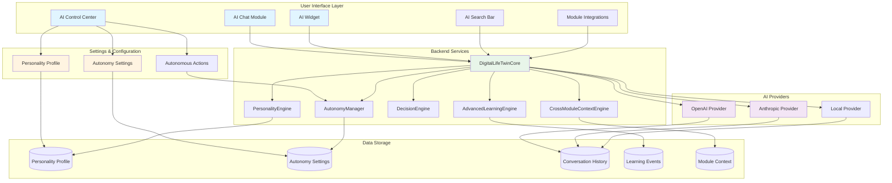
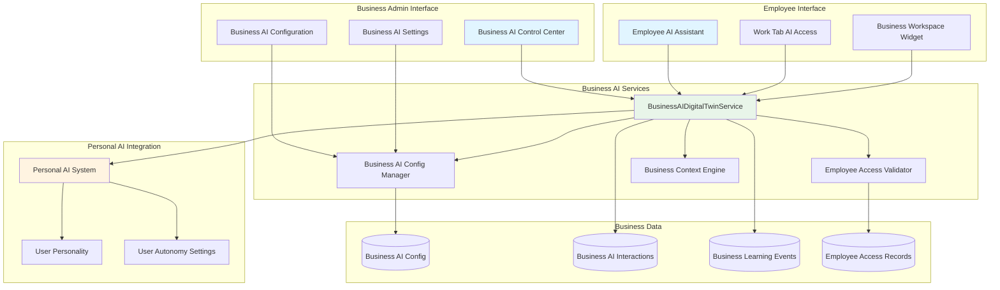
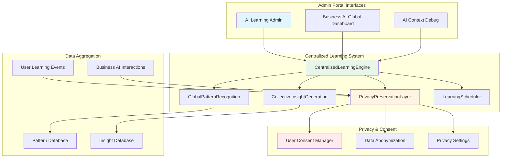

# 🤖 Vssyl AI System Architecture Map

## Complete System Overview

This document provides a comprehensive map of how the AI system works across personal, business, and administrative contexts.

---

## 🎯 Entry Points & User Interfaces

### **Personal AI Entry Points**

```
┌─────────────────────────────────────────────────────────────┐
│                    PERSONAL AI ENTRY POINTS                   │
└─────────────────────────────────────────────────────────────┘

1. AI Control Center (/ai)
   ├── Overview Tab → Shows stats, learning progress, recent activity
   ├── Autonomy Settings Tab → Configure AI autonomy levels
   ├── Personality Profile Tab → Complete personality questionnaire
   └── Autonomous Actions Tab → View/manage AI actions

2. AI Chat Module (/ai page or standalone)
   ├── Full conversation interface
   ├── Conversation history
   └── Cross-module context awareness

3. AI Widget (Dashboard)
   ├── Embedded chat interface
   ├── Quick AI access
   └── Module-specific context

4. AI Search Bar (Header)
   ├── Natural language search
   ├── AI-powered suggestions
   └── Quick actions

5. Module Integrations
   ├── Scheduling Module → SchedulingAIAssistant
   ├── Drive Module → AI context providers
   ├── Chat Module → AI-enhanced conversations
   ├── Calendar Module → AI scheduling assistance
   └── HR Module → AI context providers
```

### **Business AI Entry Points**

```
┌─────────────────────────────────────────────────────────────┐
│                  BUSINESS AI ENTRY POINTS                     │
└─────────────────────────────────────────────────────────────┘

1. Business AI Control Center (/business/[id]/ai)
   ├── Business AI Overview
   ├── Configuration & Settings
   ├── Capabilities Management
   ├── Security & Compliance
   ├── Learning Settings
   └── Centralized Insights

2. Employee AI Assistant (Work Tab)
   ├── Employee-specific AI chat
   ├── Business context awareness
   ├── Role-based capabilities
   └── Department-specific features

3. Business Workspace AI Widget
   ├── Embedded business AI
   ├── Quick access to business AI
   └── Business module context
```

### **Admin Portal Entry Points**

```
┌─────────────────────────────────────────────────────────────┐
│                  ADMIN PORTAL AI ENTRY POINTS                 │
└─────────────────────────────────────────────────────────────┘

1. AI Learning Administration (/admin-portal/ai-learning)
   ├── Overview Dashboard
   ├── Global Patterns
   ├── Collective Insights
   ├── System Health
   ├── Module Analytics
   ├── Privacy & Settings
   ├── User Consent Management
   ├── Scheduler Configuration
   └── Advanced Analytics

2. Business AI Global Dashboard (/admin-portal/business-ai)
   ├── All Business AIs Overview
   ├── Cross-Business Patterns
   ├── Global Metrics
   └── Business AI Management

3. AI Context Debug (/admin-portal/ai-context)
   ├── User Context Inspector
   ├── AI Reasoning Viewer
   ├── Context Validation Tools
   └── Cross-Module Context Map
```

---

## 🔄 Data Flow & System Architecture

### **Personal AI System Flow**



### **Business AI System Flow**



### **Admin Portal & Centralized Learning Flow**



---

## 🔗 Complete Connection Map

### **API Endpoints & Routes**

```
PERSONAL AI ENDPOINTS:
├── POST /api/ai/twin → Main Digital Life Twin query
├── POST /api/ai/chat → Legacy chat endpoint
├── GET /api/ai/context → Get user context
├── GET /api/ai/context/:module → Get module context
├── GET /api/ai/personality → Get personality profile
├── PUT /api/ai/personality → Update personality
├── GET /api/ai/autonomy/settings → Get autonomy settings
├── PUT /api/ai/autonomy/settings → Update autonomy settings
├── GET /api/ai/autonomy/recommendations → Get recommendations
├── POST /api/ai/autonomous/suggest → Suggest actions
├── GET /api/ai/autonomous/pending-approvals → Get pending approvals
├── GET /api/ai/autonomous/history → Get action history
├── POST /api/ai/autonomous/execute → Execute action
├── POST /api/ai/autonomous/approval/:id → Approve/reject action
└── GET /api/ai-stats/stats → Get AI statistics

BUSINESS AI ENDPOINTS:
├── GET /api/business-ai/:businessId → Get business AI config
├── POST /api/business-ai/:businessId/initialize → Initialize business AI
├── PUT /api/business-ai/:businessId/update → Update business AI
├── POST /api/business-ai/:businessId/interact → Employee AI interaction
├── GET /api/business-ai/:businessId/employee-access → Get employee access
└── GET /api/business-ai/:businessId/analytics → Get business AI analytics

ADMIN PORTAL ENDPOINTS:
├── GET /api/centralized-ai/patterns → Get global patterns
├── GET /api/centralized-ai/insights → Get collective insights
├── GET /api/centralized-ai/health → Get system health
├── GET /api/centralized-ai/privacy/settings → Get privacy settings
├── PUT /api/centralized-ai/privacy/settings → Update privacy settings
├── GET /api/centralized-ai/consent/stats → Get consent statistics
├── GET /api/admin/business-ai/global → Get all business AIs
└── GET /api/admin/business-ai/patterns → Get cross-business patterns
```

---

## 🎛️ Settings & Configuration Flow

### **Personal AI Settings**

```
User → AI Control Center
  ├── Autonomy Settings
  │   ├── Module Autonomy Levels (0-100%)
  │   │   ├── Scheduling
  │   │   ├── Communication
  │   │   ├── File Management
  │   │   ├── Task Creation
  │   │   ├── Data Analysis
  │   │   └── Cross-Module Actions
  │   ├── Override Settings
  │   │   ├── Work Hours Override
  │   │   ├── Family Time Override
  │   │   └── Sleep Hours Override
  │   └── Approval Thresholds
  │       ├── Financial Threshold ($)
  │       ├── Time Commitment (minutes)
  │       └── People Affected (count)
  │
  ├── Personality Profile
  │   ├── Big Five Traits
  │   ├── Communication Style
  │   ├── Work Preferences
  │   ├── Life Priorities
  │   └── Autonomy Preferences
  │
  └── Autonomous Actions
      ├── View Suggestions
      ├── Pending Approvals
      └── Action History
```

### **Business AI Settings**

```
Business Admin → Business AI Control Center
  ├── Configuration
  │   ├── AI Name & Description
  │   ├── Personality Traits
  │   ├── Communication Style
  │   └── Expertise Areas
  │
  ├── Capabilities
  │   ├── Enabled Modules
  │   ├── Disabled Modules
  │   └── Custom Capabilities
  │
  ├── Security
  │   ├── Security Level (Standard/High/Maximum)
  │   ├── Compliance Mode
  │   ├── Forbidden Topics
  │   ├── Access Level
  │   ├── Employee Data Access
  │   └── Client Data Access
  │
  └── Learning
      ├── Allow Centralized Learning
      └── Learning Preferences
```

---

## 🔄 How Settings Affect AI Behavior

### **Autonomy Settings Impact**

```
User Sets Autonomy Level → AutonomyManager.evaluateAutonomy()
  ├── Checks module-specific autonomy level
  ├── Assesses risk factors
  ├── Checks approval thresholds
  │   ├── Financial impact > threshold? → Requires approval
  │   ├── Time commitment > threshold? → Requires approval
  │   └── People affected > threshold? → Requires approval
  ├── Evaluates override settings
  │   ├── Work hours? → Block if override enabled
  │   ├── Family time? → Block if override enabled
  │   └── Sleep hours? → Block if override enabled
  └── Returns decision:
      ├── canExecute: true/false
      ├── requiresApproval: true/false
      └── approvalReason: string
```

### **Personality Profile Impact**

```
User Completes Personality Profile → PersonalityEngine.getPersonalityProfile()
  ├── Loads personality traits
  ├── Includes in AI system prompt:
  │   ├── "Openness: 75/100"
  │   ├── "Conscientiousness: 80/100"
  │   ├── "Communication Style: professional but friendly"
  │   └── "Risk Tolerance: 60/100"
  ├── AI adapts responses to match personality
  ├── DecisionEngine uses personality for:
  │   ├── Action selection
  │   ├── Reasoning generation
  │   └── Risk assessment
  └── Learning engine updates personality over time
```

---

## 🏢 Business vs Personal AI

### **Key Differences**

```
PERSONAL AI:
├── User owns and controls
├── Uses personal personality profile
├── Personal autonomy settings
├── Access to personal modules (Drive, Chat, Calendar, etc.)
├── Personal learning events
└── Individual conversation history

BUSINESS AI:
├── Business admin controls configuration
├── Business-specific personality
├── Business security and compliance settings
├── Access to business modules only
├── Business learning events (if enabled)
├── Employee-specific interactions
└── Business context awareness
```

### **Integration Points**

```
Employee Uses Business AI:
  ├── Business AI Service validates employee access
  ├── Loads business AI configuration
  ├── Gets employee's business context
  │   ├── Role & permissions
  │   ├── Department
  │   └── Active projects
  ├── Processes query with business AI
  ├── Respects business security settings
  └── Logs interaction for business analytics

Employee Also Has Personal AI:
  ├── Separate from business AI
  ├── Uses personal settings
  ├── Personal conversation history
  └── Can switch between personal and business AI
```

---

## 📊 Admin Portal Monitoring

### **What Admins Can Monitor**

```
ADMIN PORTAL → AI Learning Administration
  ├── System Overview
  │   ├── Total users with AI profiles
  │   ├── Total conversations
  │   ├── Average confidence scores
  │   └── System health metrics
  │
  ├── Global Patterns
  │   ├── Discovered patterns across all users
  │   ├── Pattern confidence scores
  │   ├── Affected modules
  │   └── Recommendations
  │
  ├── Collective Insights
  │   ├── Optimization opportunities
  │   ├── Best practices
  │   ├── Trend analysis
  │   └── Risk identification
  │
  ├── Privacy & Settings
  │   ├── Privacy level configuration
  │   ├── Data retention settings
  │   └── Anonymization rules
  │
  └── User Consent
      ├── Consent statistics
      ├── Opt-in/opt-out rates
      └── Consent management
```

---

## 🔐 Security & Privacy Flow

```
User Data → Privacy Layer
  ├── Check user consent
  ├── Anonymize if needed
  │   ├── Hash user IDs
  │   ├── Generalize locations
  │   └── Remove PII
  ├── Aggregate data (minimum 5 users)
  ├── Generate patterns
  └── Store in pattern database

Business Data:
  ├── Business admin controls access
  ├── Employee data access settings
  ├── Compliance mode enforcement
  └── Audit logging
```

---

## 🎯 Quick Reference: Where to Find What

### **For Personal Users**
- **Configure AI**: `/ai` → Autonomy Settings or Personality Profile tabs
- **Chat with AI**: `/ai` → Overview tab, or AI Chat Module, or AI Widget
- **View Actions**: `/ai` → Autonomous Actions tab
- **Check Stats**: `/ai` → Overview tab

### **For Business Admins**
- **Configure Business AI**: `/business/[id]/ai` → Configuration tab
- **Manage Security**: `/business/[id]/ai` → Security tab
- **View Analytics**: `/business/[id]/ai` → Overview tab
- **Enable Learning**: `/business/[id]/ai` → Learning tab

### **For Employees**
- **Use Business AI**: Work Tab → Employee AI Assistant
- **Access in Workspace**: Business Workspace → AI Widget

### **For Admins**
- **Monitor Learning**: `/admin-portal/ai-learning` → Overview tab
- **View Patterns**: `/admin-portal/ai-learning` → Global Patterns tab
- **Manage Privacy**: `/admin-portal/ai-learning` → Privacy & Settings tab
- **Business AI Overview**: `/admin-portal/business-ai` → Overview
- **Debug Context**: `/admin-portal/ai-context` → User Context Inspector

---

## 🔄 Complete Request Flow Example

### **User asks AI a question:**

```
1. User types query in AI Chat Module
   ↓
2. Frontend calls POST /api/ai/twin
   ↓
3. DigitalLifeTwinCore.processAsDigitalTwin()
   ├── Loads user context (CrossModuleContextEngine)
   ├── Loads personality profile (PersonalityEngine)
   ├── Loads autonomy settings (AutonomyManager)
   ├── Gets module context (Smart Context System)
   └── Builds comprehensive prompt
   ↓
4. Routes to AI Provider (OpenAI/Anthropic/Local)
   ├── Includes personality in prompt
   ├── Includes autonomy settings in prompt
   ├── Includes module context in prompt
   └── Generates response
   ↓
5. Response Processing
   ├── Extracts actions from response
   ├── Evaluates each action (AutonomyManager)
   │   ├── Checks autonomy levels
   │   ├── Checks approval thresholds
   │   └── Determines if approval needed
   ├── Creates approval requests if needed
   └── Returns response to user
   ↓
6. Frontend displays response
   ├── Shows AI message
   ├── Shows confidence score
   ├── Shows reasoning
   └── Shows actions (if any)
   ↓
7. Learning System
   ├── Records interaction (AdvancedLearningEngine)
   ├── Updates personality if needed
   ├── Sends to centralized learning (if consented)
   └── Updates patterns
```

---

## 🔌 How AI System Interacts with Modules

### **Module AI Context Registry System**

The AI system uses a **two-layer intelligent context fetching system** to interact with modules:

#### **Layer 1: Fast Query Analysis (Database Lookup)**
```
User Query → ModuleAIContextService.analyzeQuery()
  ├── Checks ModuleAIContextRegistry for keywords
  ├── Matches query against module patterns
  ├── Supports @mentions (e.g., "@drive show my files")
  └── Returns relevant modules with relevance scores
```

#### **Layer 2: Context Fetching (API Calls)**
```
Relevant Modules → ModuleAIContextService.fetchModuleContext()
  ├── Calls module's context provider endpoints
  ├── Caches responses (5-15 minutes)
  └── Returns structured context data
```

### **Module Registration Flow**

```
Module Installation/Startup
  ↓
Module Registers AI Context
  ├── Keywords (e.g., ["file", "document", "upload"])
  ├── Patterns (e.g., ["show my files", "upload * to drive"])
  ├── Concepts (e.g., ["storage", "documents"])
  ├── Entities (e.g., [{ name: "file", pluralName: "files" }])
  ├── Actions (e.g., [{ name: "upload", permissions: [...] }])
  └── Context Providers (e.g., [{ name: "recentFiles", endpoint: "/api/drive/ai/context/recent" }])
  ↓
Stored in ModuleAIContextRegistry (Database)
  ↓
Available for AI Query Analysis
```

### **Complete Module Interaction Flow**

```mermaid
graph TB
    subgraph "User Query"
        A1[User asks: "Show my recent files"]
    end

    subgraph "Query Analysis Layer"
        B1[ModuleAIContextService.analyzeQuery]
        B2[Search ModuleAIContextRegistry]
        B3[Match Keywords & Patterns]
        B4[Find Relevant Modules]
    end

    subgraph "Context Fetching Layer"
        C1[ModuleAIContextService.fetchModuleContext]
        C2[Check Cache]
        C3[Call Module Context Provider]
        C4[Format Response]
    end

    subgraph "Module Context Providers"
        D1[Drive: /api/drive/ai/context/recent]
        D2[Chat: /api/chat/ai/context/conversations]
        D3[Calendar: /api/calendar/ai/context/upcoming]
        D4[HR: /api/hr/ai/context/overview]
        D5[Scheduling: /api/scheduling/ai/context/overview]
    end

    subgraph "AI Processing"
        E1[DigitalLifeTwinCore]
        E2[Build AI Prompt with Context]
        E3[Generate Response]
    end

    A1 --> B1
    B1 --> B2
    B2 --> B3
    B3 --> B4
    B4 --> C1
    C1 --> C2
    C2 -->|Cache Miss| C3
    C2 -->|Cache Hit| C4
    C3 --> D1
    C3 --> D2
    C3 --> D3
    C3 --> D4
    C3 --> D5
    D1 --> C4
    D2 --> C4
    D3 --> C4
    D4 --> C4
    D5 --> C4
    C4 --> E1
    E1 --> E2
    E2 --> E3

    style A1 fill:#e1f5ff
    style B1 fill:#fff4e1
    style C1 fill:#e8f5e9
    style D1 fill:#f3e5f5
    style E1 fill:#e8f5e9
```

### **Module Context Provider Pattern**

Every module that wants AI integration implements **context provider endpoints**:

```typescript
// Example: Drive Module Context Provider
GET /api/drive/ai/context/recent
  → Returns: { success: true, context: { recentFiles: [...], summary: {...} } }

GET /api/drive/ai/context/storage-stats
  → Returns: { success: true, context: { totalStorage: 5.2GB, used: 2.1GB } }

GET /api/drive/ai/context/file-search
  → Returns: { success: true, context: { matchingFiles: [...] } }
```

### **Built-in Module Examples**

#### **Drive Module**
- **Keywords**: `["file", "files", "upload", "download", "document", "storage", "drive", "folder"]`
- **Patterns**: `["show my files", "upload * to drive", "find files *", "recent documents"]`
- **Context Providers**:
  - `recentFiles` → `/api/drive/ai/context/recent`
  - `storageStats` → `/api/drive/ai/context/storage-stats`
  - `fileSearch` → `/api/drive/ai/context/file-search`

#### **Chat Module**
- **Keywords**: `["message", "messages", "chat", "conversation", "send", "reply"]`
- **Patterns**: `["send message *", "my messages", "recent messages", "unread messages"]`
- **Context Providers**:
  - `recentConversations` → `/api/chat/ai/context/recent-conversations`
  - `unreadMessages` → `/api/chat/ai/context/unread-messages`
  - `conversationHistory` → `/api/chat/ai/context/conversation-history`

#### **Calendar Module**
- **Keywords**: `["calendar", "event", "events", "meeting", "appointment", "schedule"]`
- **Patterns**: `["my calendar", "upcoming events", "meetings today", "schedule *"]`
- **Context Providers**:
  - `upcomingEvents` → `/api/calendar/ai/context/upcoming-events`
  - `todaySchedule` → `/api/calendar/ai/context/today-schedule`
  - `availability` → `/api/calendar/ai/context/availability`

#### **HR Module**
- **Keywords**: `["employee", "employees", "hr", "staff", "team member", "attendance"]`
- **Patterns**: `["my employees", "employee count", "attendance *", "hr overview"]`
- **Context Providers**:
  - `hrOverview` → `/api/hr/ai/context/overview`
  - `employeeCount` → `/api/hr/ai/context/employee-count`
  - `timeOffSummary` → `/api/hr/ai/context/time-off-summary`

#### **Scheduling Module**
- **Keywords**: `["schedule", "shift", "shifts", "coverage", "roster", "scheduling"]`
- **Patterns**: `["my schedule", "schedule *", "coverage status", "scheduling conflicts"]`
- **Context Providers**:
  - `schedulingOverview` → `/api/scheduling/ai/context/overview`
  - `coverageStatus` → `/api/scheduling/ai/context/coverage-status`
  - `schedulingConflicts` → `/api/scheduling/ai/context/conflicts`

### **How AI Uses Module Context**

#### **Step-by-Step Example: "Show my recent files"**

```
1. User Query: "Show my recent files"
   ↓
2. Query Analysis (FAST - Database Lookup)
   ├── Searches ModuleAIContextRegistry
   ├── Finds "files" keyword matches Drive module
   ├── Finds "recent" pattern matches Drive module
   └── Returns: { moduleId: "drive", relevance: "high" }
   ↓
3. Context Fetching (SLOW - API Call)
   ├── Checks cache (if cached < 15 min, return cached)
   ├── Calls: GET /api/drive/ai/context/recent
   ├── Drive module queries database for recent files
   └── Returns: { recentFiles: [...], summary: {...} }
   ↓
4. AI Processing
   ├── DigitalLifeTwinCore receives query + context
   ├── Builds prompt: "User asked: 'Show my recent files'. 
       Context: User has 5 recent files: [file1, file2, ...]"
   ├── AI generates response with actual file data
   └── Returns: "Here are your recent files: [list of files]"
   ↓
5. Response to User
   └── AI displays actual file names and details
```

### **Cross-Module Intelligence**

The AI system can also make **cross-module connections**:

```
User Query: "What files did I share in my chat with John?"
  ↓
AI Analysis:
  ├── Detects "files" → Drive module
  ├── Detects "chat" → Chat module
  └── Detects "John" → User/relationship context
  ↓
AI Fetches Context:
  ├── From Chat: Conversation with John
  ├── From Drive: Files shared in that conversation
  └── Cross-reference: Files linked to chat messages
  ↓
AI Response:
  └── "You shared 3 files with John: [file1, file2, file3]"
```

### **Module Integration Points**

#### **1. Module Registration**
- **When**: During module installation or startup
- **Where**: `server/src/startup/registerBuiltInModules.ts` or module installation API
- **What**: Registers keywords, patterns, context providers in `ModuleAIContextRegistry`

#### **2. Context Provider Endpoints**
- **Pattern**: `/api/[module]/ai/context/[provider-name]`
- **Controller**: `[module]AIContextController.ts`
- **Response Format**: `{ success: true, context: {...}, metadata: {...} }`

#### **3. Query Analysis**
- **Endpoint**: `POST /api/ai/analyze-query`
- **Service**: `ModuleAIContextService.analyzeQuery()`
- **Returns**: Relevant modules with relevance scores

#### **4. Context Fetching**
- **Service**: `ModuleAIContextService.fetchModuleContext()`
- **Caching**: 5-15 minutes (configurable per provider)
- **Error Handling**: Graceful fallback if module unavailable

### **Module AI Context Requirements**

For a module to be AI-aware, it must provide:

1. **AI Context Definition** (registered in `ModuleAIContextRegistry`):
   - Keywords that trigger the module
   - Patterns users might say
   - Concepts the module deals with
   - Entities it manages
   - Actions users can perform
   - Context provider endpoints

2. **Context Provider Endpoints** (implemented in module):
   - At least 2-3 context providers
   - Fast response times (< 500ms)
   - Proper authentication
   - Structured response format
   - Error handling

3. **Controller Implementation**:
   - `[module]AIContextController.ts` file
   - Functions like `getContextForAI()`, `getOverviewContext()`, etc.
   - Routes registered under `/api/[module]/ai/context/*`

### **Performance Optimizations**

#### **Smart Context Fetching**
- **Before**: AI fetched context from ALL modules (slow)
- **After**: AI analyzes query first, only fetches from relevant modules (fast)

#### **Caching Strategy**
- Context providers cache responses for 5-15 minutes
- Cache stored in `ModuleInstallation.cachedContext`
- Cache invalidation on data updates

#### **Parallel Fetching**
- When multiple modules are relevant, contexts fetched in parallel
- Uses `Promise.all()` for concurrent requests

### **Module Interaction Examples**

#### **Example 1: Simple Query**
```
User: "How many files do I have?"
  ↓
AI Analysis: "files" → Drive module (high relevance)
  ↓
AI Fetches: GET /api/drive/ai/context/storage-stats
  ↓
Response: "You have 127 files using 2.1GB of storage"
```

#### **Example 2: Cross-Module Query**
```
User: "What meetings do I have today and what files do I need?"
  ↓
AI Analysis: 
  ├── "meetings" → Calendar module (high relevance)
  └── "files" → Drive module (high relevance)
  ↓
AI Fetches (Parallel):
  ├── GET /api/calendar/ai/context/today-schedule
  └── GET /api/drive/ai/context/recent
  ↓
Response: "You have 3 meetings today: [list]. 
           Here are relevant files: [list]"
```

#### **Example 3: Module-Specific Query with @mention**
```
User: "@drive show my recent PDFs"
  ↓
AI Analysis: @drive mention → Skip keyword matching, directly target Drive
  ↓
AI Fetches: GET /api/drive/ai/context/file-search?type=pdf
  ↓
Response: "Here are your recent PDF files: [list]"
```

### **Module AI Context Data Flow**

```
┌─────────────────────────────────────────────────────────────┐
│                    MODULE AI INTERACTION                     │
└─────────────────────────────────────────────────────────────┘

1. MODULE REGISTRATION
   Module → registerBuiltInModules.ts
   → ModuleAIContextRegistry (Database)
   → Available for query analysis

2. USER QUERY
   User → "Show my files"
   → DigitalLifeTwinCore.processAsDigitalTwin()
   → CrossModuleContextEngine.getContextForAIQuery()

3. QUERY ANALYSIS (Fast)
   → ModuleAIContextService.analyzeQuery()
   → Searches ModuleAIContextRegistry
   → Finds: Drive module (relevance: high)

4. CONTEXT FETCHING (Slow, but cached)
   → ModuleAIContextService.fetchModuleContext()
   → Checks cache (ModuleInstallation.cachedContext)
   → If cache miss: GET /api/drive/ai/context/recent
   → DriveAIContextController.getRecentFilesContext()
   → Queries database, formats response
   → Caches result

5. AI PROCESSING
   → DigitalLifeTwinCore builds prompt with context
   → Includes: "User has 5 recent files: [list]"
   → AI Provider generates response
   → Returns to user with actual data
```

### **Module Developer Integration Checklist**

For module developers wanting AI integration:

- [ ] **Define AI Context**: Create `ModuleAIContext` object with keywords, patterns, etc.
- [ ] **Create Context Controller**: Implement `[module]AIContextController.ts`
- [ ] **Add Context Provider Routes**: Register under `/api/[module]/ai/context/*`
- [ ] **Register Module**: Call registration API or add to `registerBuiltInModules.ts`
- [ ] **Test Integration**: Use `/api/ai/analyze-query` to verify detection
- [ ] **Monitor Performance**: Check admin portal for query success rates

---

## 📝 Summary

The Vssyl AI system is a **multi-layered, context-aware intelligence platform** that:

1. **Personal AI**: Gives users complete control over their AI assistant with personality and autonomy settings
2. **Business AI**: Provides businesses with their own AI that respects security, compliance, and business context
3. **Centralized Learning**: Enables collective intelligence while maintaining strict privacy controls
4. **Admin Monitoring**: Gives administrators tools to monitor, manage, and optimize the AI system

All systems are interconnected, with settings flowing from user configuration → AI behavior → learning → pattern recognition → insights → improvements.

